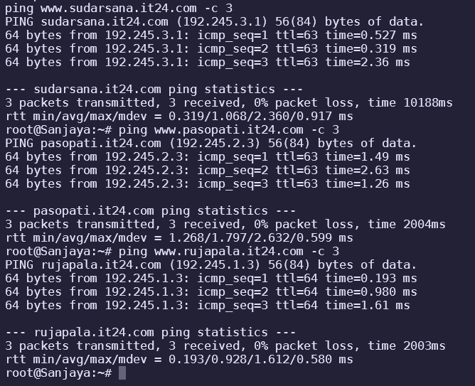
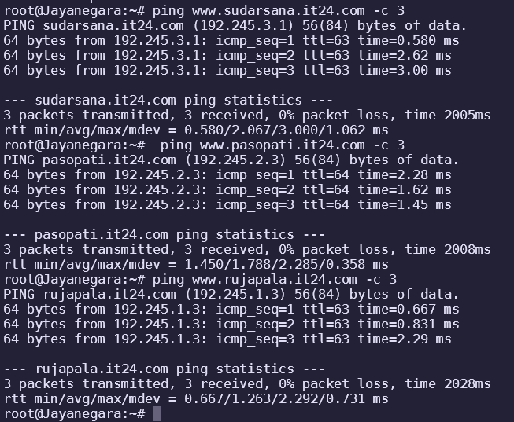
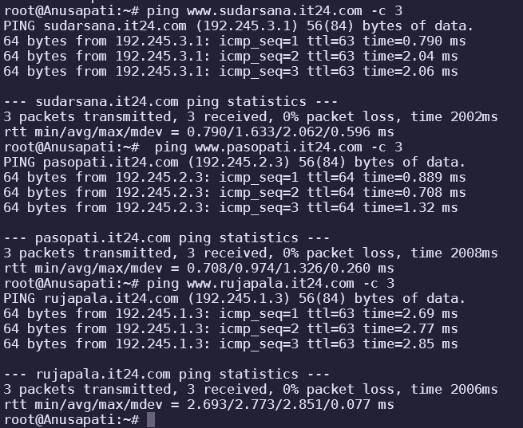
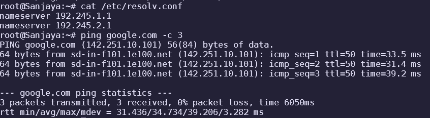
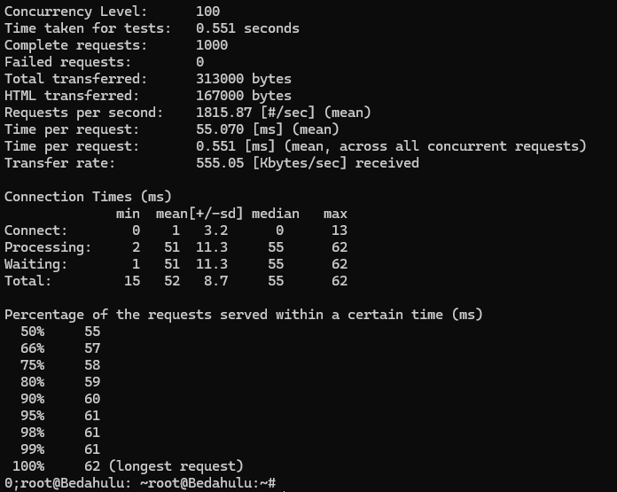
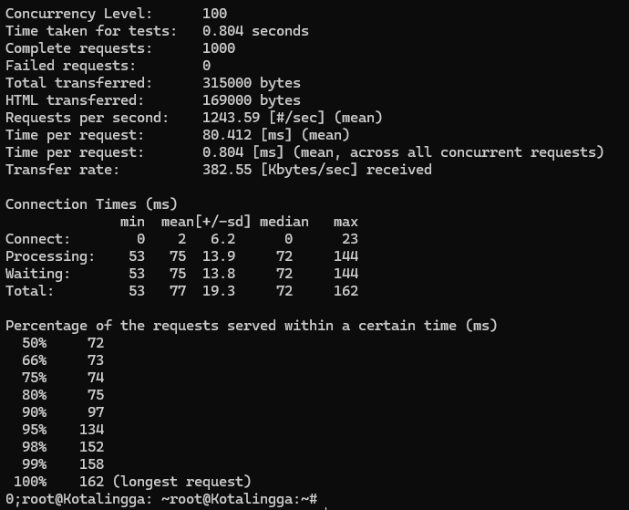
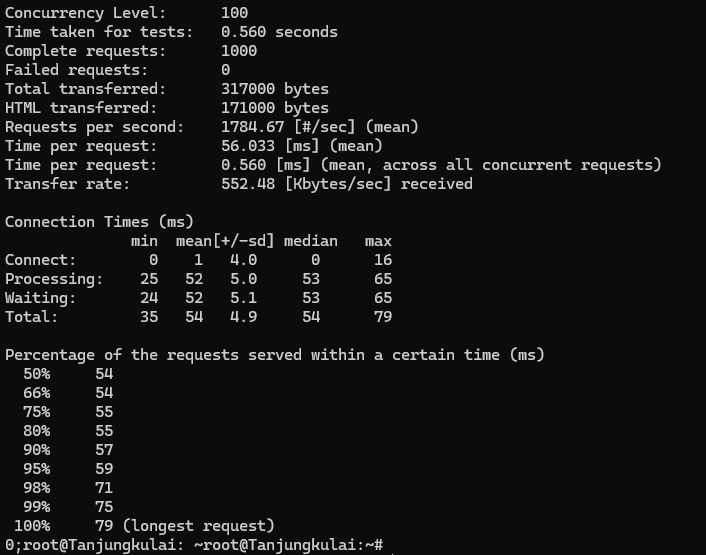

# Jarkom-Modul-2-IT24-2024

| Nama | NRP |
|---|---|
|Amoes Noland|5027231028|
|Radella Chesa Syaharani|5027231064|

## Daftar Soal

- [Soal 1](#soal-1)
- [Soal 2](#soal-2)
- [Soal 3](#soal-3)
- [Soal 4](#soal-4)
- [Soal 5](#soal-5)
- [Soal 6](#soal-6)
- [Soal 7](#soal-7)
- [Soal 8](#soal-8)
- [Soal 9](#soal-9)
- [Soal 10](#soal-10)
- [Soal 11](#soal-11)
- [Soal 12](#soal-12)
- [Soal 13](#soal-13)
- [Soal 14](#soal-14)
- [Soal 15](#soal-15)

## Script Umum

### Nusantara (Router)

```sh
iptables -t nat -A POSTROUTING -o eth0 -j MASQUERADE -s 192.245.0.0/16
echo nameserver 192.168.122.1 > /etc/resolv.conf
echo End of script
```

### Sriwijaya, Mahapahit (DNS Master/Slave)

```sh
echo nameserver 192.168.122.1 > /etc/resolv.conf
apt update
apt install bind9 -y
echo End of script
```

### Sanjaya, Jayanegara, Anusapati (Clients)

```sh
echo nameserver 192.245.1.1 > /etc/resolv.conf
echo End of script
```


## Soal 1
Untuk mempersiapkan peperangan World War MMXXIV (Iya sebanyak itu), **Sriwijaya** membuat dua kotanya menjadi web server yaitu **Tanjungkulai**, dan **Bedahulu**, serta **Sriwijaya** sendiri akan menjadi DNS Master. Kemudian karena merasa terdesak, **Majapahit** memberikan bantuan dan menjadikan kerajaannya (**Majapahit**) menjadi **DNS Slave**.
### Nusantara (Router)

```
auto eth0
iface eth0 inet dhcp

auto eth1
iface eth1 inet static
	address 192.245.1.2
	netmask 255.255.255.0

auto eth2
iface eth2 inet static
	address 192.245.2.2
	netmask 255.255.255.0

auto eth3
iface eth3 inet static
	address 192.245.3.2
	netmask 255.255.255.0
```

### Sriwijaya (DNS Master)

```
auto eth0
iface eth0 inet static
	address 192.245.1.1
	netmask 255.255.255.0
	gateway 192.245.1.2
```

### Majapahit (DNS Slave)

```
auto eth0
iface eth0 inet static
	address 192.245.2.1
	netmask 255.255.255.0
	gateway 192.245.2.2
```

### Tanjungkulai (Web Server)

```
auto eth0
iface eth0 inet static
	address 192.245.1.3
	netmask 255.255.255.0
	gateway 192.245.1.2
```

### Bedahulu (Web Server)

```
auto eth0
iface eth0 inet static
	address 192.245.1.4
	netmask 255.255.255.0
	gateway 192.245.1.2
```

### Kotalingga (Web Server)

```
auto eth0
iface eth0 inet static
	address 192.245.2.3
	netmask 255.255.255.0
	gateway 192.245.2.2
```

### Sanjaya (Client)

```
auto eth0
iface eth0 inet static
	address 192.245.1.11
	netmask 255.255.255.0
	gateway 192.245.1.2
```

### Jayanegara (Client)

```
auto eth0
iface eth0 inet static
	address 192.245.2.11
	netmask 255.255.255.0
	gateway 192.245.2.2
```

### Anusapati (Client)

```
auto eth0
iface eth0 inet static
	address 192.245.2.12
	netmask 255.255.255.0
	gateway 192.245.2.2
```

### Solok (Load Balancer)

```
auto eth0
iface eth0 inet static
	address 192.245.3.1
	netmask 255.255.255.0
	gateway 192.245.3.2
```

## Soal 2
Karena para pasukan membutuhkan koordinasi untuk melancarkan serangannya, maka buatlah sebuah domain yang mengarah ke **Solok** dengan alamat **sudarsana.xxxx.com** dengan alias **www.sudarsana.xxxx.com**, dimana **xxxx** merupakan kode kelompok. Contoh: **sudarsana.it01.com**.

### Script Solok (sudarsana.it24.com)

```sh
echo 'zone "sudarsana.it24.com" {
    type master;
    notify yes;
    file "/etc/bind/jarkom/sudarsana.it24.com";
};' > /etc/bind/named.conf.local

mkdir -p /etc/bind/jarkom

cp /etc/bind/db.local /etc/bind/jarkom/sudarsana.it24.com

echo '
;
; BIND data file for local loopback interface
;
$TTL    604800
@       IN      SOA     sudarsana.it24.com. root.sudarsana.it24.com. (
                        2024100201      ; Serial
                        604800         ; Refresh
                        86400         ; Retry
                        2419200         ; Expire
                        604800 )       ; Negative Cache TTL
;
@       IN      NS      sudarsana.it24.com.
@       IN      A       192.245.3.1     ; IP Solok
www     IN      CNAME   sudarsana.it24.com.' > /etc/bind/jarkom/sudarsana.it24.com

service bind9 restart
```

## Soal 3
Para pasukan juga perlu mengetahui mana titik yang akan diserang, sehingga dibutuhkan domain lain yaitu **pasopati.xxxx.com** dengan alias **www.pasopati.xxxx.com** yang **mengarah ke Kotalingga**.


### Script Kotalingga (pasopati.it24.com)

```sh
echo 'zone "pasopati.it24.com" {
    type master;
    notify yes;
    file "/etc/bind/jarkom/pasopati.it24.com";
};' >> /etc/bind/named.conf.local

mkdir -p /etc/bind/jarkom

cp /etc/bind/db.local /etc/bind/jarkom/pasopati.it24.com

echo '
;
; BIND data file for local loopback interface
;
$TTL    604800
@       IN      SOA     pasopati.it24.com. root.pasopati.it24.com. (
                        2024100201      ; Serial
                        604800         ; Refresh
                        86400         ; Retry
                        2419200         ; Expire
                        604800 )       ; Negative Cache TTL
;
@       IN      NS      pasopati.it24.com.
@       IN      A       192.245.2.3     ; IP Kotalingga
www     IN      CNAME   pasopati.it24.com.' > /etc/bind/jarkom/pasopati.it24.com

service bind9 restart
```

## Soal 4
Markas pusat meminta dibuatnya domain khusus untuk menaruh informasi persenjataan dan suplai yang tersebar. Informasi dan suplai meme terbaru tersebut **mengarah ke Tanjungkulai** dan domain yang ingin digunakan adalah **rujapala.xxxx.com** dengan alias **www.rujapala.xxxx.com**.


### Script Tanjungkulai (rujapala.it24.com)

```sh
echo 'zone "rujapala.it24.com" {
    type master;
    notify yes;
    file "/etc/bind/jarkom/rujapala.it24.com";
};' >> /etc/bind/named.conf.local

mkdir -p /etc/bind/jarkom

cp /etc/bind/db.local /etc/bind/jarkom/rujapala.it24.com

echo '
;
; BIND data file for local loopback interface
;
$TTL    604800
@       IN      SOA     rujapala.it24.com. root.rujapala.it24.com. (
                        2024100201      ; Serial
                        604800         ; Refresh
                        86400         ; Retry
                        2419200         ; Expire
                        604800 )       ; Negative Cache TTL
;
@       IN      NS      rujapala.it24.com.
@       IN      A       192.245.1.3     ; IP Tanjungkulai
www     IN      CNAME   rujapala.it24.com.' > /etc/bind/jarkom/rujapala.it24.com

service bind9 restart
```

## Soal 5
Pastikan domain-domain tersebut dapat diakses oleh **seluruh komputer (client)** yang berada di **Nusantara**.

### Sanjaya



### Jayanegara



### Anusapati



## Soal 6
Beberapa daerah memiliki keterbatasan yang menyebabkan hanya dapat mengakses domain secara langsung melalui **alamat IP** domain tersebut. Karena daerah tersebut tidak diketahui secara spesifik, pastikan semua komputer (client) dapat mengakses domain **pasopati.xxxx.com** melalui **alamat IP Kotalingga** (Notes: menggunakan pointer record).
### Script Reverse DNS Kotalingga

```sh
echo 'zone "2.245.192.in-addr.arpa" {
    type master;
    file "/etc/bind/jarkom/2.245.192.in-addr.arpa";
};' >> /etc/bind/named.conf.local

mkdir -p /etc/bind/jarkom

cp /etc/bind/db.local /etc/bind/jarkom/2.245.192.in-addr.arpa

echo '
;
; BIND data file for local loopback interface
;
$TTL    604800
@       IN      SOA     pasopati.it24.com. root.pasopati.it24.com. (
                        2024100201         ; Serial
                        604800         ; Refresh
                        86400         ; Retry
                        2419200         ; Expire
                        604800 )       ; Negative Cache TTL
;
2.245.192.in-addr.arpa.      IN      NS      pasopati.it24.com.
3                            IN      PTR     pasopati.it24.com.' > /etc/bind/jarkom/2.245.192.in-addr.arpa

service bind9 restart
```

### Modifikasi pada Client script

```sh
echo nameserver 192.245.1.1 > /etc/resolv.conf
apt update
apt install dnsutils -y
echo End of script
```

## Soal 7
Akhir-akhir ini seringkali terjadi **serangan brainrot** ke DNS Server Utama, sebagai tindakan antisipasi kamu diperintahkan untuk membuat **DNS Slave di Majapahit** untuk semua domain yang sudah dibuat sebelumnya yang mengarah ke **Sriwijaya**.

### Script untuk named.conf.local (DNS Master)

```sh
echo 'zone "sudarsana.it24.com" {
    type master;
    notify yes;
    also-notify { 192.245.2.1; };
    allow-transfer { 192.245.2.1; };
    file "/etc/bind/jarkom/sudarsana.it24.com";
};
zone "pasopati.it24.com" {
    type master;
    notify yes;
    also-notify { 192.245.2.1; };
    allow-transfer { 192.245.2.1; };
    file "/etc/bind/jarkom/pasopati.it24.com";
};
zone "rujapala.it24.com" {
    type master;
    notify yes;
    also-notify { 192.245.2.1; };
    allow-transfer { 192.245.2.1; };
    file "/etc/bind/jarkom/rujapala.it24.com";
};
zone "2.245.192.in-addr.arpa" {
    type master;
    file "/etc/bind/jarkom/2.245.192.in-addr.arpa";
};' > /etc/bind/named.conf.local
```

### Script untuk named.conf.local (DNS Slave)

```sh
echo 'zone "sudarsana.it24.com" {
    type slave;
    masters { 192.245.1.1; };
    file "/etc/bind/jarkom/sudarsana.it24.com";
};
zone "pasopati.it24.com" {
    type slave;
    masters { 192.245.1.1; };
    file "/etc/bind/jarkom/pasopati.it24.com";
};
zone "rujapala.it24.com" {
    type slave;
    masters { 192.245.1.1; };
    file "/etc/bind/jarkom/rujapala.it24.com";
};' > /etc/bind/named.conf.local
```

### Modifikasi pada Client script

```sh
echo nameserver 192.245.1.1 > /etc/resolv.conf # Master
echo nameserver 192.245.2.1 >> /etc/resolv.conf # Slave
apt update
apt install dnsutils -y
echo End of script
```

## Soal 8
Kamu juga diperintahkan untuk membuat subdomain khusus melacak kekuatan tersembunyi **di Ohio** dengan subdomain **cakra.sudarsana.xxxx.com** yang mengarah ke Bedahulu.

### Modifikasi Script Sudarsana untuk Subdomain

```sh
echo 'zone "sudarsana.it24.com" {
    type master;
    notify yes;
    file "/etc/bind/jarkom/sudarsana.it24.com";
};' > /etc/bind/named.conf.local

mkdir -p /etc/bind/jarkom

cp /etc/bind/db.local /etc/bind/jarkom/sudarsana.it24.com

echo '
;
; BIND data file for local loopback interface
;
$TTL    604800
@       IN      SOA     sudarsana.it24.com. root.sudarsana.it24.com. (
                        2024100201      ; Serial
                        604800         ; Refresh
                        86400         ; Retry
                        2419200         ; Expire
                        604800 )       ; Negative Cache TTL
;
@       IN      NS      sudarsana.it24.com.
@       IN      A       192.245.3.1     ; IP Solok
www     IN      CNAME   sudarsana.it24.com.
cakra	IN      A       192.245.3.2     ; IP Bedahulu' > /etc/bind/jarkom/sudarsana.it24.com

service bind9 restart
```

## Soal 9
Karena terjadi serangan DDOS oleh shikanoko nokonoko koshitantan (NUN), sehingga sistem komunikasinya terhalang. Untuk melindungi warga, kita diperlukan untuk membuat sistem peringatan dari siren man oleh Frekuensi Freak dan memasukkannya ke subdomain **panah.pasopati.xxxx.com** dalam folder panah dan pastikan dapat diakses secara mudah dengan menambahkan alias **www.panah.pasopati.xxxx.com** dan mendelegasikan subdomain tersebut ke **Majapahit** dengan alamat IP menuju radar di **Kotalingga**.

### Modifikasi Script Pasopati untuk Subdomain (Sriwijaya)

```sh
echo 'zone "pasopati.it24.com" {
    type master;
    notify yes;
    file "/etc/bind/jarkom/pasopati.it24.com";
};' >> /etc/bind/named.conf.local

mkdir -p /etc/bind/jarkom

cp /etc/bind/db.local /etc/bind/jarkom/pasopati.it24.com

echo '
;
; BIND data file for local loopback interface
;
$TTL    604800
@       IN      SOA     pasopati.it24.com. root.pasopati.it24.com. (
                        2024100201      ; Serial
                        604800         ; Refresh
                        86400         ; Retry
                        2419200         ; Expire
                        604800 )       ; Negative Cache TTL
;
@       IN      NS      pasopati.it24.com.
@       IN      A       192.245.2.3     ; IP Kotalingga
www     IN      CNAME   pasopati.it24.com.
ns1		IN		A		192.245.2.1		; delegasi IP Majapahit
panah	IN		NS		ns1				; subdomain IP delegasi'> /etc/bind/jarkom/pasopati.it24.com

service bind9 restart
```

### Script Subdomain Delegasi Panah (Majapahit)

```sh
echo 'zone "panah.pasopati.it24.com" {
    type master;
    notify yes;
    file "/etc/bind/panah/panah.pasopati.it24.com";
};' >> /etc/bind/named.conf.local

mkdir -p /etc/bind/panah

cp /etc/bind/db.local /etc/bind/panah/panah.pasopati.it24.com

echo '
;
; BIND data file for local loopback interface
;
$TTL    604800
@       IN      SOA     panah.pasopati.it24.com. root.panah.pasopati.it24.com. (
                        2024100201      ; Serial
                        604800         ; Refresh
                        86400         ; Retry
                        2419200         ; Expire
                        604800 )       ; Negative Cache TTL
;
@       IN      NS      panah.pasopati.it24.com.
@       IN      A       192.245.2.3     ; IP Kotalingga
www     IN      CNAME   panah.pasopati.it24.com.'> /etc/bind/panah/panah.pasopati.it24.com

service bind9 restart
```

### Modifikasi script untuk named.conf.local (DNS Master)

```sh
echo '
options {
	directory "/var/cache/bind";
	allow-query { any; };
	auth-nxdomain no; #conform to RFC1035
	listen-on-v6 { any; };
};' > /etc/bind/named.conf.options

echo 'zone "sudarsana.it24.com" {
    type master;
    notify yes;
    also-notify { 192.245.2.1; };
    allow-transfer { 192.245.2.1; };
    file "/etc/bind/jarkom/sudarsana.it24.com";
};
zone "pasopati.it24.com" {
    type master;
    notify yes;
    also-notify { 192.245.2.1; };
    allow-transfer { 192.245.2.1; };
    file "/etc/bind/jarkom/pasopati.it24.com";
};
zone "rujapala.it24.com" {
    type master;
    notify yes;
    also-notify { 192.245.2.1; };
    allow-transfer { 192.245.2.1; };
    file "/etc/bind/jarkom/rujapala.it24.com";
};
zone "2.245.192.in-addr.arpa" {
    type master;
    file "/etc/bind/jarkom/2.245.192.in-addr.arpa";
};' > /etc/bind/named.conf.local
```

### Modifikasi script untuk named.conf.local (DNS Slave)

```sh
echo '
options {
	directory "/var/cache/bind";
	allow-query { any; };
	auth-nxdomain no; #conform to RFC1035
	listen-on-v6 { any; };
};' > /etc/bind/named.conf.options

echo 'zone "sudarsana.it24.com" {
    type slave;
    masters { 192.245.1.1; };
    file "/etc/bind/jarkom/sudarsana.it24.com";
};
zone "pasopati.it24.com" {
    type slave;
    masters { 192.245.1.1; };
    file "/etc/bind/jarkom/pasopati.it24.com";
};
zone "rujapala.it24.com" {
    type slave;
    masters { 192.245.1.1; };
    file "/etc/bind/jarkom/rujapala.it24.com";
};' > /etc/bind/named.conf.local
```

## Soal 10
Markas juga meminta catatan kapan saja meme brain rot akan dijatuhkan, maka buatlah subdomain baru di subdomain panah yaitu **log.panah.pasopati.xxxx.com** serta aliasnya **www.log.panah.pasopati.xxxx.com** yang juga mengarah ke **Kotalingga**.

### Modifikasi Script Subdomain Delegasi Panah

```sh
echo 'zone "panah.pasopati.it24.com" {
    type master;
    notify yes;
    file "/etc/bind/panah/panah.pasopati.it24.com";
};' >> /etc/bind/named.conf.local

mkdir -p /etc/bind/panah

cp /etc/bind/db.local /etc/bind/panah/panah.pasopati.it24.com

echo '
;
; BIND data file for local loopback interface
;
$TTL    604800
@       IN      SOA     panah.pasopati.it24.com. root.panah.pasopati.it24.com. (
                        2024100201      ; Serial
                        604800         ; Refresh
                        86400         ; Retry
                        2419200         ; Expire
                        604800 )       ; Negative Cache TTL
;
@       IN      NS      panah.pasopati.it24.com.
@       IN      A       192.245.2.3     ; IP Kotalingga
www     IN      CNAME   panah.pasopati.it24.com.
log     IN      A       192.245.2.3     ; IP Kotalingga
www.log IN      CNAME   panah.pasopati.it24.com.'> /etc/bind/panah/panah.pasopati.it24.com

service bind9 restart
```

## Soal 11
Setelah pertempuran mereda, warga IT dapat kembali mengakses jaringan luar dan menikmati meme brainrot terbaru, tetapi **hanya** warga **Majapahit** saja yang dapat mengakses jaringan luar secara **langsung**. Buatlah konfigurasi agar warga IT yang berada diluar Majapahit dapat mengakses jaringan luar **melalui** DNS Server **Majapahit**.
### Modifikasi script untuk named.conf.local (Majapahit)

```sh
echo '
options {
	directory "/var/cache/bind";

    forwarders {
        192.168.122.1;
    };

	allow-query { any; };
	auth-nxdomain no; #conform to RFC1035
	listen-on-v6 { any; };
};' > /etc/bind/named.conf.options

echo 'zone "sudarsana.it24.com" {
    type slave;
    masters { 192.245.1.1; };
    file "/etc/bind/jarkom/sudarsana.it24.com";
};
zone "pasopati.it24.com" {
    type slave;
    masters { 192.245.1.1; };
    file "/etc/bind/jarkom/pasopati.it24.com";
};
zone "rujapala.it24.com" {
    type slave;
    masters { 192.245.1.1; };
    file "/etc/bind/jarkom/rujapala.it24.com";
};' > /etc/bind/named.conf.local
```

### Hasil ping luar tanpa nameserver NAT



## Soal 12
Karena pusat ingin sebuah laman web yang ingin digunakan untuk memantau kondisi kota lainnya maka deploy laman web ini (cek resource yg lb) pada **Kotalingga** menggunakan **apache**.
### Modifikasi pada Client script

```sh
echo nameserver 192.245.1.1 > /etc/resolv.conf # Master
echo nameserver 192.245.2.1 >> /etc/resolv.conf # Slave
apt update
apt install dnsutils -y
apt install lynx -y
echo End of script
```

### Script di Kotalingga

```sh
echo nameserver 192.245.1.1 > /etc/resolv.conf # Master
echo nameserver 192.245.2.1 >> /etc/resolv.conf # Slave

apt update
apt install apache2 libapache2-mod-php7.0 php wget unzip -y

cp /etc/apache2/sites-available/000-default.conf /etc/apache2/sites-available/pasopati.it24.com.conf

echo '
<VirtualHost *:80>
    ServerAdmin webmaster@localhost
    DocumentRoot /var/www/html
    ServerName pasopati.it24.com
    ServerAlias www.pasopati.it24.com
</VirtualHost>
' > /etc/apache2/sites-available/pasopati.it24.com.conf

service apache2 start
a2ensite pasopati.it24.com.conf

wget --no-check-certificate 'https://docs.google.com/uc?export=download&id=1Sqf0TIiybYyUp5nyab4twy9svkgq8bi7' -O lb.zip

unzip -o lb.zip -d lb
rm /var/www/html/index.html
cp lb/worker/index.php /var/www/html/index.php

service apache2 restart
```

## Soal 13
Karena Sriwijaya dan Majapahit memenangkan pertempuran ini dan memiliki banyak uang dari hasil penjarahan (sebanyak 35 juta, belum dipotong pajak) maka pusat meminta kita memasang load balancer untuk membagikan uangnya pada web nya, dengan **Kotalingga, Bedahulu, Tanjungkulai** sebagai worker dan **Solok** sebagai **Load Balancer** menggunakan apache sebagai web server nya dan load balancer nya.

### Script Load Balancer Solok (Apache)

```sh
apt update
apt install apache2 -y

a2enmod proxy
a2enmod proxy_balancer
a2enmod proxy_http
a2enmod lbmethod_byrequests

echo '
echo nameserver 192.168.122.1 > /etc/resolv.conf

<VirtualHost *:80>
    <Proxy balancer://mycluster>
        BalancerMember http://192.245.1.3
        BalancerMember http://192.245.1.4
        BalancerMember http://192.245.2.3
        ProxySet lbmethod=byrequests
    </Proxy>

    ProxyPass / balancer://mycluster/
    ProxyPassReverse / balancer://mycluster/

</VirtualHost>
' > /etc/apache2/sites-available/000-default.conf

service apache2 restart
```

### Script Web Server (web-apache.sh)

```sh
echo nameserver 192.245.1.1 > /etc/resolv.conf # Master
echo nameserver 192.245.2.1 >> /etc/resolv.conf # Slave

apt update
apt install apache2 libapache2-mod-php7.0 php wget unzip -y

wget --no-check-certificate 'https://docs.google.com/uc?export=download&id=1Sqf0TIiybYyUp5nyab4twy9svkgq8bi7' -O lb.zip

unzip -o lb.zip -d lb
rm /var/www/html/index.html
cp lb/worker/index.php /var/www/html/index.php

service apache2 restart
```

## Soal 14
Selama melakukan penjarahan mereka melihat bagaimana web server luar negeri, hal ini membuat mereka iri, dengki, sirik dan ingin flexing sehingga meminta agar web server dan load balancer nya **diubah menjadi nginx.

### Catatan Mengenai Service

Dikarenakan penggunaan service nginx memerlukan untuk mematikan service apache, maka ditambahkan command `service apache stop` dan `service nginx stop` pada script yang bersangkutan. Sehingga, bila ingin kembali ke apache/nginx hanya perlu menjalankan script sesuai keperluan.

### Script Web Server (web-nginx.sh)

Hanya jalankan ini di .bashrc ketika tidak ingin apache

```sh
apt update
apt install nginx php php-fpm -y

mkdir -p /var/www/jarkom
cp /var/www/html/index.php /var/www/jarkom/index.php

echo '
server {
    listen 80;

    root /var/www/jarkom;

    index index.php index.html index.htm;
    server_name _;

    location / {
        try_files $uri $uri/ /index.php?$query_string;
    }

    # pass PHP scripts to FastCGI server
    location ~ \.php$ {
        include snippets/fastcgi-php.conf;
        fastcgi_pass unix:/var/run/php/php7.0-fpm.sock;
    }

    location ~ /\.ht {
        deny all;
    }

    error_log /var/log/nginx/jarkom_error.log;
    access_log /var/log/nginx/jarkom_access.log;
}
' > /etc/nginx/sites-available/jarkom

ln -s /etc/nginx/sites-available/jarkom /etc/nginx/sites-enabled/jarkom
rm -rf /etc/nginx/sites-enabled/default

service apache2 stop
service nginx restart
service php7.0-fpm stop
service php7.0-fpm start
```

### Script Load Balancer Solok (Nginx)

Hanya jalankan ini di .bashrc ketika tidak ingin apache

```sh
apt update
apt install bind9 nginx -y

echo '
upstream webserver  {
    server 192.245.1.3;
    server 192.245.1.4;
    server 192.245.2.3;
}

server {
    listen 80;
    server_name _;

    location / {
        proxy_pass http://webserver;
    }
}' > /etc/nginx/sites-available/solok

ln -s /etc/nginx/sites-available/solok /etc/nginx/sites-enabled/solok
rm /etc/nginx/sites-enabled/default

service nginx restart
```

## Soal 15
Markas pusat meminta **laporan hasil benchmark** dengan menggunakan apache benchmark dari load balancer dengan 2 web server yang berbeda tersebut dan meminta secara detail dengan ketentuan:
- Nama Algoritma Load Balancer
- Report hasil testing apache benchmark 
- Grafik request per second untuk masing masing algoritma. 
- Analisis
- Meme terbaik kalian (terserah ( ͡° ͜ʖ ͡°)) 🤓

Untuk mencari algoritma terbaik bisa dilihat disini: [Mencari Algoritma Terbaik](best-algorithm.md)

### Laporan Benchmark

#### Bedahulu

#### Kotalingga

#### Tanjungkulai


### Analisis
Berdasarkan hasil benchmark dari web server menunjukkan bahwa **Bedahulu** dan **Tanjungkulai** memiliki performa yang lebih baik dengan throughput tinggi (*requests per second* di atas 1700) dan *latency* rendah (*time per request* antara 55-56ms), menjadikannya lebih responsif dalam menangani beban *concurrent* tinggi. Sedangkan **Kotalingga** menunjukkan performa yang lebih rendah dengan throughput 1243 request/sec dan *time per request* lebih lama (80ms), menunjukkan bahwa server ini membutuhkan optimisasi lebih lanjut untuk menandingi performa **Bedahulu** dan **Tanjungkulai**.

## Soal 16

### Script untuk Domain Solok 

```sh
echo 'zone "solok.it24.com" {
    type master;
    notify yes;
    file "/etc/bind/jarkom/solok.it24.com";
};' >> /etc/bind/named.conf.local

cp /etc/bind/db.local /etc/bind/jarkom/solok.it24.com

echo '
;
; BIND data file for local loopback interface
;
$TTL    604800
@       IN      SOA     solok.it24.com. root.solok.it24.com. (
                        2024100201      ; Serial
                        604800         ; Refresh
                        86400         ; Retry
                        2419200         ; Expire
                        604800 )       ; Negative Cache TTL
;
@       IN      NS      solok.it24.com.
@       IN      A       192.245.3.1     ; IP Solok
www     IN      CNAME   solok.it24.com.' > /etc/bind/jarkom/solok.it24.com

service bind9 restart
```

## Soal 17

### Modifikasi Script Load Balancer Solok (Nginx)

```sh
apt update
apt install nginx -y

echo '
upstream webserver  {
    least_conn;
    server 192.245.1.3;
    server 192.245.1.4;
    server 192.245.2.3;
}

server {
  listen 31400;
  server_name solok.it24.com www.solok.it24.com;

  location / {
    proxy_pass http://webserver;
  }
}

server {
  listen 4697;
  server_name solok.it24.com www.solok.it24.com;

  location / {
    proxy_pass http://webserver;
  }
}

server {
  listen 8082;
  listen 8083;
  listen 8084;
  server_name 192.245.3.1;

  return 404;
}
' > /etc/nginx/sites-available/solok

ln -s /etc/nginx/sites-available/solok /etc/nginx/sites-enabled/solok
rm /etc/nginx/sites-enabled/default

service apache2 stop
service nginx restart
```

## Soal 18

### Modifikasi Script Load Balancer Solok (Nginx)

```sh
apt update
apt install nginx -y

echo '
upstream webserver  {
    least_conn;
    server 192.245.1.3;
    server 192.245.1.4;
    server 192.245.2.3;
}

server {
  listen 31400;
  server_name solok.it24.com www.solok.it24.com;

  location / {
    proxy_pass http://webserver;
  }
}

server {
  listen 4697;
  server_name solok.it24.com www.solok.it24.com;

  location / {
    proxy_pass http://webserver;
  }
}

server {
    listen 80 default_server;
    server_name 192.245.3.1;

    return 301 http://www.solok.it24.com:31400;
}

server {
  listen 8082;
  listen 8083;
  listen 8084;
  server_name 192.245.3.1;

  return 404;
}
' > /etc/nginx/sites-available/solok

ln -s /etc/nginx/sites-available/solok /etc/nginx/sites-enabled/solok
rm /etc/nginx/sites-enabled/default

service apache2 stop
service nginx restart
```

## Soal 19

Mengetahui bahwa Bedahulu memiliki benchmark terbaik, maka kami memilih untuk membuat akses direktori listing di dalam web server tersebut.

## Script Directory Listing Bedahulu

```sh
wget --no-check-certificate 'https://drive.google.com/uc?export=download&id=1JGk8b-tZgzAOnDqTx5B3F9qN6AyNs7Zy' -O dir-listing.zip

unzip -o dir-listing.zip -d /var/www/jarkom/

echo '
server {
    listen 80;
    server_name sekianterimakasih.it24.com www.sekianterimakasih.it24.com;

    root /var/www/jarkom;
    index index.php index.html index.htm;

    location / {
        alias /var/www/jarkom/dirlisting/worker2;
        autoindex on;
        autoindex_exact_size off;
        autoindex_format html;
        autoindex_localtime on;
    }

    error_log /var/log/nginx/error.log;
    access_log /var/log/nginx/access.log;
}
' > /etc/nginx/sites-enabled/jarkom

service nginx restart
```

## Soal 20

```sh
echo 'zone "sekianterimakasih.it24.com" {
    type master;
    notify yes;
    file "/etc/bind/jarkom/sekianterimakasih.it24.com";
};' >> /etc/bind/named.conf.local

cp /etc/bind/db.local /etc/bind/jarkom/sekianterimakasih.it24.com

echo '
;
; BIND data file for local loopback interface
;
$TTL    604800
@       IN      SOA     sekianterimakasih.it24.com. root.sekianterimakasih.it24.com. (
                        2024100201      ; Serial
                        604800         ; Refresh
                        86400         ; Retry
                        2419200         ; Expire
                        604800 )       ; Negative Cache TTL
;
@       IN      NS      sekianterimakasih.it24.com.
@       IN      A       192.245.1.4     ; IP Bedahulu
www     IN      CNAME   sekianterimakasih.it24.com.' > /etc/bind/jarkom/sekianterimakasih.it24.com

service bind9 restart
```