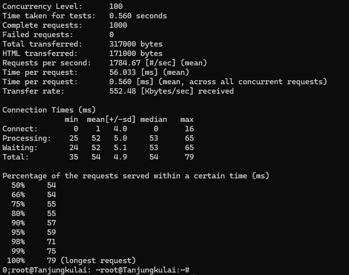

## Mencari Load-Balancer Terbaik

### Script Load Balancer Solok (Nginx)
```sh
apt update
apt install nginx -y

echo '
upstream webserver  {
    # defaultnya round robin
    # least_conn;
    # ip_hash;
    server 192.245.1.3;
    server 192.245.1.4;
    server 192.245.2.3;
}

server {
    listen 80;
    server_name _;

    location / {
        proxy_pass http://webserver;
    }
}' > /etc/nginx/sites-available/solok

ln -s /etc/nginx/sites-available/solok /etc/nginx/sites-enabled/solok
rm /etc/nginx/sites-enabled/default

service nginx restart
```

#### Round Robin

#### Least Connections

#### IP Hash


### Analisis
**Least Connections** terbukti memberikan performa terbaik dengan jumlah *failed request* paling sedikit, *transfer rate* tertinggi, dan *time per request* paling cepat, karena algoritma ini mendistribusikan beban berdasarkan jumlah koneksi aktif di server. **Round Robin** menunjukkan performa yang cukup baik, namun masih kalah dalam menangani beban yang tidak merata dibandingkan **Least Connections**. Sementara, **IP Hash** menghasilkan performa terburuk dengan tingkat kegagalan tertinggi dan waktu respon paling lambat, menunjukkan bahwa algoritma ini kurang ideal untuk lingkungan dengan beban dinamis.

### Laporan Benchmark

#### Bedahulu

#### Kotalingga

#### Tanjungkulai


### Analisis
Berdasarkan hasil benchmark dari web server menunjukkan bahwa **Bedahulu** dan **Tanjungkulai** memiliki performa yang lebih baik dengan throughput tinggi (*requests per second* di atas 1700) dan *latency* rendah (*time per request* antara 55-56ms), menjadikannya lebih responsif dalam menangani beban *concurrent* tinggi. Sedangkan **Kotalingga** menunjukkan performa yang lebih rendah dengan throughput 1243 request/sec dan *time per request* lebih lama (80ms), menunjukkan bahwa server ini membutuhkan optimisasi lebih lanjut untuk menandingi performa **Bedahulu** dan **Tanjungkulai**.
